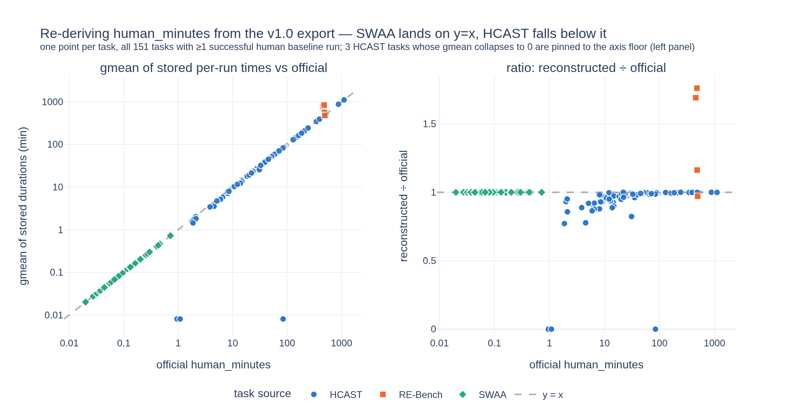
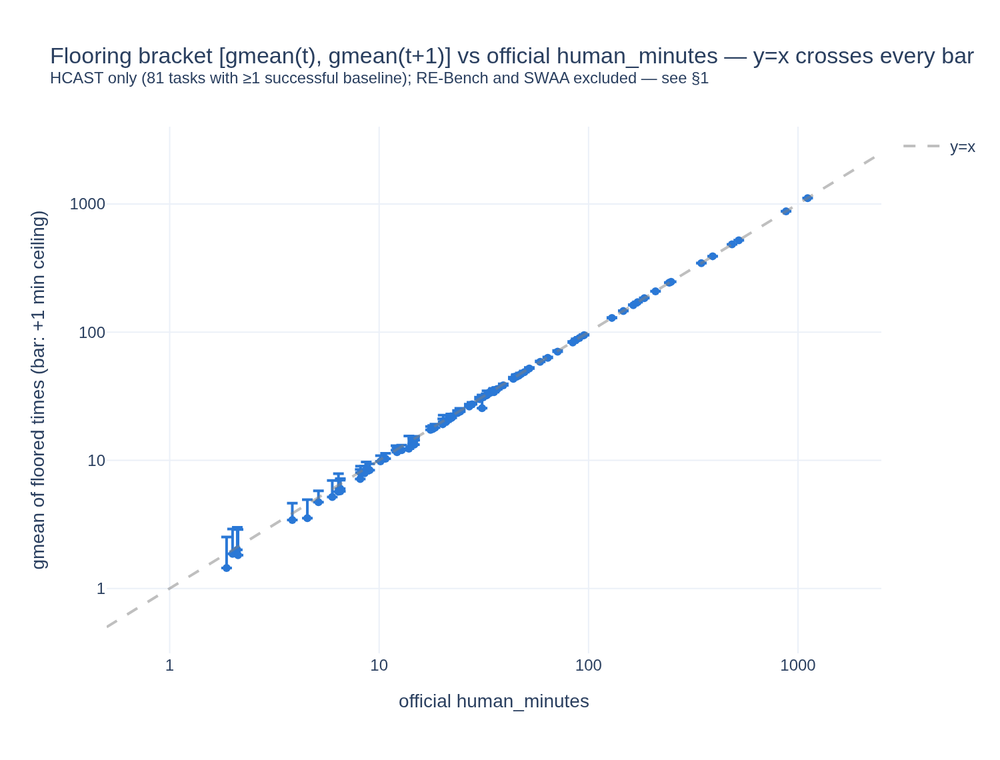
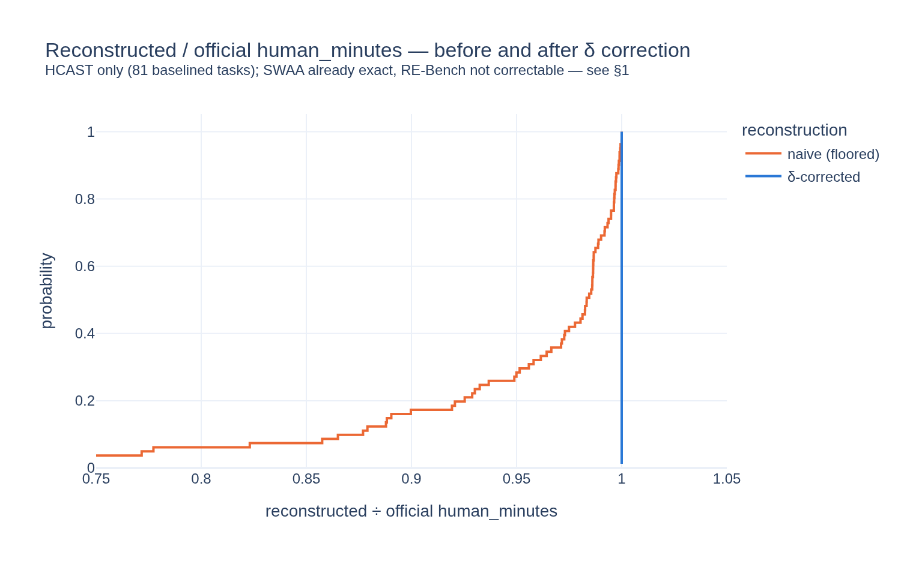

# Stage 1 — Export archaeology: recovering per-run human baseline times

**TL;DR:** In the public export, the durations of human baseline runs were floored to the whole minute before release, while the official per-task `human_minutes` (computed upstream from the unfloored times) kept full precision. We show this, and then repair it *at the task level*: for each task we solve for a single sub-minute offset δ_task that makes the task's geometric mean reproduce the official `human_minutes` exactly. That is an **imputation, not a recovery** — the true per-run fractional minutes are gone for good, and every run on a task gets the same δ — but it removes the systematic downward bias the flooring introduced (up to ~20% on short tasks), and we publish the resulting per-run dataset for downstream use.

## The symptom

`human_minutes` is defined as the geometric mean of successful human baseliners' completion times. Re-derive it from the export's per-run timestamps and plot it against the official value: whether that works depends entirely on the task source.

* **SWAA** (66 tasks) lands on y=x to within 4×10⁻⁴ — stored to the millisecond, nothing to fix.
* **HCAST** (81 tasks) falls *below* the line, never above, by up to ~20%, worst on short tasks — the signature of a downward truncation.
* **RE-Bench** (4 tasks) sits *above* the line by up to 76% — its `human_minutes` isn't a gmean of elapsed times at all (8h-capped sessions), so it's a different problem entirely.

**Everything below is HCAST-only.** It is the only source that needs the correction, and the only one that admits it.

## The finding

Three facts explain the HCAST gap:

1. **HCAST and RE-Bench durations are whole minutes** (100% of 558 runs); SWAA durations are stored to the millisecond (0% whole minutes). The flooring bites short tasks proportionally hardest.
2. **For all 21 single-baseliner tasks, the stored duration equals `floor(human_minutes)` exactly** — for n=1 the aggregate *is* that run's time, so this pins down the scheme: a floor (not a round), applied to the per-run times only. The official numbers have full precision; only the export is lossy.
3. **The flooring bracket `gmean(t) ≤ human_minutes < gmean(t+1)` holds for 81/81 HCAST baselined tasks** — including three successful runs stored as *0 minutes* (dropping those, instead of keeping them, is a trap: one zero collapses a geometric mean).

## The patch: δ_task

The bracket guarantees a unique per-task offset δ_task ∈ [0,1) with `gmean(t + δ_task) = human_minutes`. Solving it reproduces the official aggregate to **max residual 5×10⁻¹⁴** across all 81 HCAST tasks:

δ is a *shared per-task* constant, not a per-run measurement: it is chosen so the task's geometric mean comes out right, and it says nothing about which run within a task took the extra seconds. The true per-run residuals are unrecoverable, so where sub-minute *spread* matters, treat corrected times as interval data `[t, t+1)` rather than as point values.

## The deliverable

[`data/human_runs_derived.csv`](data/human_runs_derived.csv) — all 793 human baseline runs of **v1.0** with `minutes_derived` and an explicit `derivation` flag:

| derivation | n | meaning |
|---|---|---|
| `delta_corrected` | 291 | HCAST success: floored + δ_task (aggregate-exact) |
| `swaa_exact` | 235 | SWAA: ms precision, no correction needed |
| `delta_imputed_failure` | 117 | HCAST failure: δ_task as best guess (δ identified from successes only) |
| `uncorrected_rebench` | 91 | RE-Bench: different time convention; no δ ∈ [0,1) exists |
| `uncorrected_no_delta` | 59 | HCAST runs on tasks with no successful baseline |

The v1.1 equivalent is [`data/human_runs_derived_v1_1.csv`](data/human_runs_derived_v1_1.csv) (773 runs). Downstream stages consume the v1.0 file, matching the paper's suite.

## Both public suites

METR's v1.1 release re-cuts the human baseline data: the same 467 HCAST human runs are mapped onto a finer set of task ids (94 baselined tasks vs 81), and 20 RE-Bench runs are dropped. The flooring is a property of the export pipeline, not of one snapshot, and it carries over untouched:

| check | v1.0 | v1.1 |
|---|---|---|
| human runs | 793 | 773 |
| HCAST durations that are whole minutes | 100% | 100% |
| single-baseliner tasks with stored == `floor(human_minutes)` | 21 / 21 | 29 / 29 |
| HCAST baselined tasks where the bracket holds | 81 / 81 | 94 / 94 |
| max \|gmean(t+δ) / official − 1\| | 5.1×10⁻¹⁴ | 6.7×10⁻¹⁴ |
| max SWAA \|gmean / official − 1\| (uncorrected) | 4.0×10⁻⁴ | 4.0×10⁻⁴ |

Full derivation with code: [`analysis.ipynb`](analysis.ipynb) (source: `analysis.py`, jupytext-paired).
