# Stage 2 — Measurement error in `human_minutes`

How much does uncertainty in the x-axis — each task's human completion time — matter for
the headline results? METR's hierarchical bootstrap resamples task families, tasks, and
agent runs, but carries a **fixed** `human_minutes` per task through every replicate: the
x-axis contributes nothing to their published confidence intervals.

Sub-analyses (all done):

| | approach | assumption level |
|---|---|---|
| **(a0)** [Nonparametric x-bootstrap](#a0--nonparametric-x-bootstrap) | resample *which baseline runs* enter each task's geometric mean | none (lower bound) |
| **(b)** [Per-task σ via empirical Bayes](#b--per-task-σ-via-empirical-bayes-shrinkage) | hierarchical estimate of per-task log-time spread, incl. $n=1$ tasks | parametric |
| **(a)** [Parametric x-bootstrap](#a--parametric-x-bootstrap-with-per-task-σ) | draw every task's `human_minutes` from $\mathrm{LogNormal}(\cdot,\ \mathrm{SEM}^2_{\text{task}})$ | parametric |
| **(c)** [Coherent ±1σ shift](#c--coherent-1σ-shift-systematic-error-worst-case) | shift *all* tasks the same direction (systematic-error worst case) | parametric |
| **(d)** [SIMEX with per-task σ](#d--simex-with-per-task-σ) | errors-in-variables *point-estimate* correction vs METR's global σ | parametric |

## Bottom line

The x-axis matters for the *absolute* horizon numbers but barely for the *doubling
time*, which is remarkably robust: independent x-noise
averages out (its 95% interval widens ~2 days even with every task perturbed, (a)), and a
coherent systematic bias — even a full ±1σ — moves it by at most ~10% while swinging
absolute horizons by ~×2.3 ((c)). The place where the x-axis changes a *published point estimate*
rather than just its error bar is the errors-in-variables attenuation corrected by SIMEX
in (d) — and that effect is **strongly uneven across agents**, which the per-agent figure
in (d) shows and a summary median hides: the 80%-horizon rises 25–40% for essentially
every capable agent, while the 50%-horizon barely moves for most and drops sharply only at
the very top (−19% for Claude Opus 4.5). Our per-task σ makes that correction *slightly
larger*, not smaller, than METR's global σ=0.78 — overturning our initial guess — because
the long HCAST/RE-Bench tasks that drive the top end are a touch noisier than 0.78 (see
(b)). Shared fit machinery for (a0)/(a)/(c)/(d):
[`metr_fit_helpers.py`](metr_fit_helpers.py), which reproduces METR's published p50/p80 exactly.

### A note on "frontier agents"

METR's doubling time is fitted over the agents that were **state of the art on their
release date** (the running maximum of the 50%-horizon), which their code calls the
*frontier* set. We keep that definition but avoid the bare word "frontier", since these
models are no longer frontier: v1.0's most capable member is **Claude Opus 4.5** and
v1.1's is **Claude Opus 4.6**. Below they are the **SOTA-at-release agents** (17 of
them on v1.0, 14 on v1.1), and the newest one is named explicitly wherever it carries
the headline. (Throughout, this set is held fixed at METR's published membership even
under corrected x-axes — comparability is the point, though a large enough correction
could in principle change who was SOTA at release.)

Everything below is on **Time Horizon v1.0** (the paper's suite). The whole chain also
runs on **v1.1** (228 tasks; agents from GPT-4 (Mar 2023) onward; Inspect harness) via
`DATASET_VERSION=1-1` — see [Extending to v1.1](#extending-to-v11) at the end, which
under METR's own extrapolant lands within ~2 points of their published Opus 4.6 SIMEX
headline (−33.8% vs −36%).

## (a0) — Nonparametric x-bootstrap

**Design:** three bootstrap conditions × 500 replicates, all using METR's own fit code and
headline parameters (weighted logistic, regularization 1e-5, `invsqrt_task_weight`), on
Time Horizon v1.0:

- `metr` — METR's family→task→run resampling (replicates their CI);
- `metr+x` — same, plus per-replicate resampling of each task's successful baseline runs
  (δ-corrected times from [Stage 1](../stage-1-export-archaeology/)), re-computing its
  `human_minutes` as the geometric mean of the resample;
- `x_only` — x-resampling alone, isolating the pure x-axis contribution.

126 / 170 tasks have ≥2 successful baseline runs and a geometric-mean-consistent `human_minutes`
and hence vary; **n=1 tasks (21), researcher-estimate tasks, and RE-Bench are held fixed**
— this is by construction a *lower bound* on x-axis uncertainty, and the frozen tasks are
disproportionately the long ones.

**Result: the assumption-free floor is small.**

- Per-agent p50 intervals widen by a **median 3.8%** in log-width across the 17
  SOTA-at-release agents (max ≈ 10%: o1-preview +9.8%, Claude 3.7 Sonnet +8.1%); the pure
  x-axis contribution is ~0.2–2% of total interval variance.
- The **doubling-time** 95% CI: [172, 224] days (`metr`) → [170, 226] days (`metr+x`),
  ~5% wider; medians essentially unchanged (199.3 → 197.9 days). Pure-x doubling-time
  spread is just ±2.4 days — per-task independent noise largely averages out across the
  ~130 varying tasks.

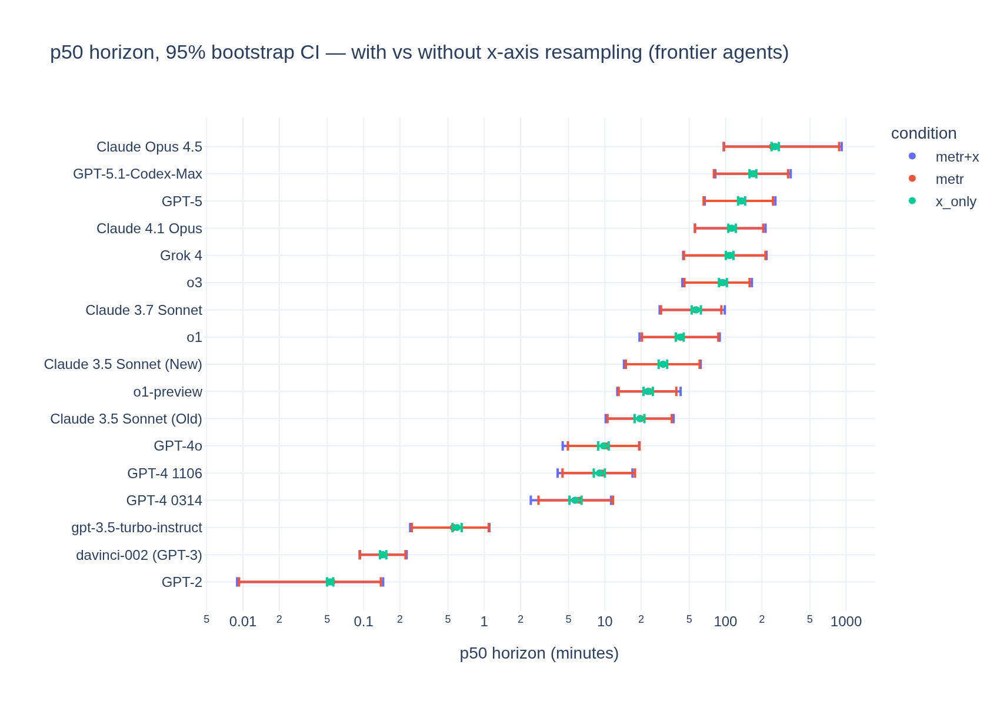

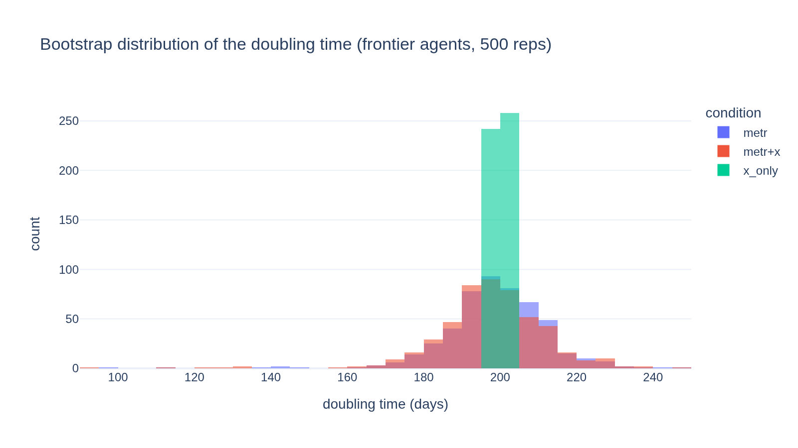

**Interpretation.** The *resampleable* component of x-axis noise barely moves the headline
results — reassuring for METR's published CIs as far as it goes. What this floor cannot
see is exactly where the remaining risk lives: single-baseline tasks, researcher estimates
(the long tasks driving the top-end horizons), small-n variance understatement, and
*systematic* (correlated) errors in baseline conventions. Those are the targets of
(b)–(d), and of the survival analysis in Stage 3.

Code: [`a0_nonparametric_xboot.py`](a0_nonparametric_xboot.py) (jupytext; paired executed
notebook [`a0_nonparametric_xboot.ipynb`](a0_nonparametric_xboot.ipynb)). Outputs:
[`data/a0_ci_by_agent.csv`](data/a0_ci_by_agent.csv),
[`data/a0_doubling_times.csv`](data/a0_doubling_times.csv).

## (b) — Per-task σ via empirical-Bayes shrinkage

**Goal:** $\sigma_j$ — the standard deviation of $\ln(\text{completion time})$ across human
baseliners on task $j$ — for *every* task, including the 21 single-baseline tasks where no
spread is observable at all.

**Method:** the *limma/eBayes* moderated-variance model (Smyth 2004). The true task
variances are drawn from a scaled-inverse-$\chi^2$ prior,
$\sigma_j^2 \sim \text{scaled-inv-}\chi^2(d_0,\ s_0^2)$, and the observed sample variance
$s_j^2$ (on $d_j = n_j - 1$ degrees of freedom) is $\chi^2$ noise around it. The posterior
mean is a precision-weighted average — the shrinkage formula:

$$\tilde\sigma_j^2 \;=\; \frac{d_0\,s_0^2 \;+\; d_j\,s_j^2}{d_0 + d_j}$$

The hyperparameters $(d_0,\ s_0^2)$ are estimated from the ensemble of tasks by **method of
moments** on $\log s_j^2$: its observed dispersion decomposes into known $\chi^2$ sampling
noise plus true between-task spread, both expressible in trigamma functions. Because
between-baseliner spread differs systematically by source, the prior is fit **per task
source** (RE-Bench, with only 7 spread-observable tasks, borrows the HCAST prior).

**Results — the raw spreads were misleading; METR's global σ = 0.78 is roughly right
for the tasks that matter, and if anything slightly low:**

- **HCAST: $d_0 = \infty$ (complete pooling), common $\sigma \approx 0.89$.** The observed
  dispersion of $\log s_j^2$ (2.33) is *fully* explained by $\chi^2$ sampling noise around
  a single common σ (expected 2.46): with $n_j = 2\text{–}4$ runs per task, task-to-task
  heterogeneity in σ is undetectable. The raw sample SDs (median 0.61) sit below 0.78 only
  because $s_j$ is downward-biased at tiny $n_j$ — after bias removal the common σ is
  slightly **above** METR's 0.78 (per-task SEM ratio ours/METR ≈ 1.14).
- **SWAA: genuine heterogeneity** ($d_0 \approx 2.5$) around a much smaller
  $s_0 \approx 0.30$ — METR's global 0.78 overstates SWAA noise ~2.5×, but these are
  seconds-scale tasks with little influence on the top end.
- **Estimate tasks:** three RE-Bench estimate tasks also have successful runs in the
  export; their estimate-vs-geometric-mean log errors are 0.12 / 0.41 / 0.12 — small next
  to METR's assumed $\sigma = 1.05$ ($n=3$, indicative only; all three "estimates" are
  exactly the 480-min budget).
- Implied multiplicative factor $e^{\mathrm{SEM}}$ per task: HCAST median ×1.88, SWAA ×1.18.

**Implication for (c)/(d):** the sign of the refinement is no longer predetermined.
Relative to METR's global assumption, per-task σ says *slightly more* x-noise on
HCAST/RE-Bench (the long, top-end-driving tasks) and much less on SWAA and possibly
estimates — whether METR's −26…−36% SIMEX haircut grows or shrinks under per-task σ is
exactly what (d) will measure.

**Two robustness checks on the stark HCAST result:**

- **(a) The $d_0 = \infty$ boundary doesn't move the numbers (c)/(d) consume.** A
  bootstrap over the 60 HCAST tasks detects finite heterogeneity in only ~⅓ of
  resamples (median $d_0 \approx 11$), so the boundary is a coin-flip and a full-Bayes
  posterior would keep mass on finite $d_0$. But recomputing the shrunken $\tilde\sigma_j$ under
  $d_0 \in \{\infty, 20, 10\}$: the median stays fixed at $s_0$ and the mean shifts ~1%; only a few
  high-$s_j$ tasks move (the most extreme, 0.89 → 1.30, and only at the implausibly
  heterogeneous $d_0 = 10$). Since $d_j \le 2$ for 46/60 tasks, every plausible prior
  gives heavy shrinkage. The result is a statement about the *story* (n=2–3 can't
  resolve heterogeneity), not the aggregate scale.
- **(b) Non-normal within-task log-times would *reinforce*, not overturn, the result.**
  Of four HCAST tasks with n ≥ 9, two are near-normal and two markedly heavier-tailed
  (`orm_somebugs` n=57, excess kurtosis +9.5; `pico_ctf/166` +3.5). Heavy tails inflate
  the true sampling dispersion of $s_j^2$ beyond the χ² model — so the −0.12 dispersion
  *deficit* driving $d_0 = \infty$ is if anything understated. The honest caveat heavy
  tails leave is separate: σ is an incomplete summary and the CLT-based $\mathrm{SEM} = \tilde\sigma_j/\sqrt{n_j}$ is
  optimistic at small n — which is why (a0)'s assumption-free bootstrap remains the
  reported floor and (c)/(d) are read as smooth complements.

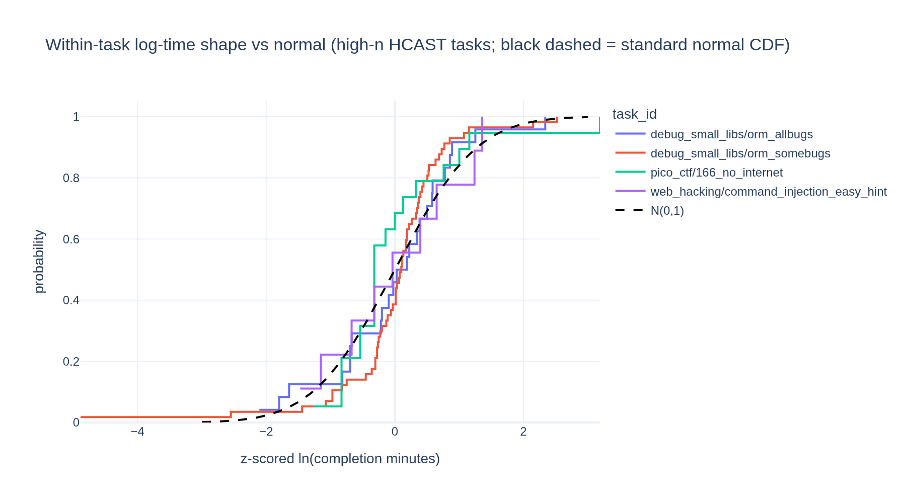

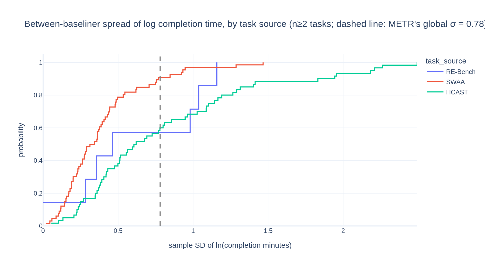

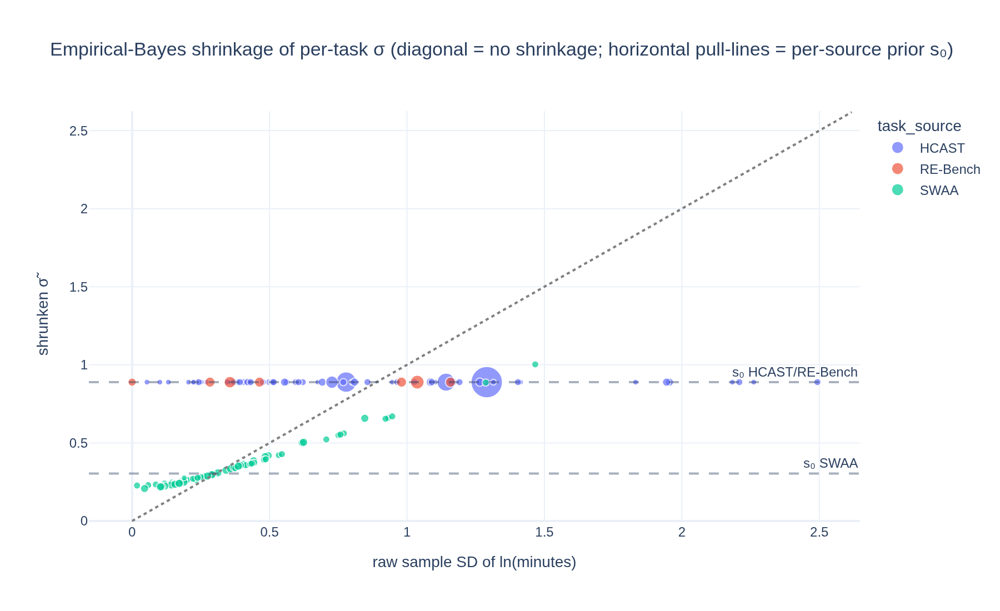

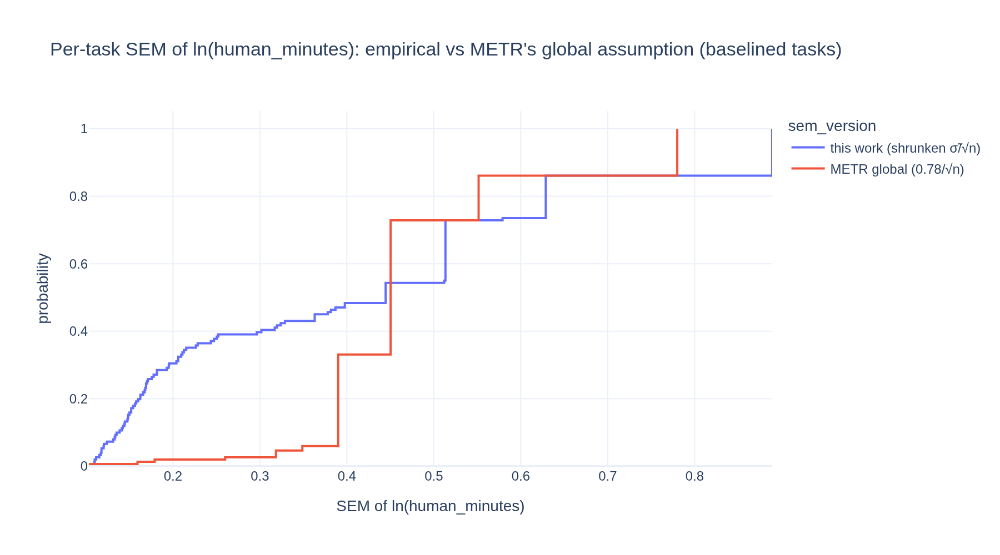

Code: [`b_sigma_task.py`](b_sigma_task.py) (jupytext; paired executed notebook
[`b_sigma_task.ipynb`](b_sigma_task.ipynb)). Output:
[`data/b_sigma_by_task.csv`](data/b_sigma_by_task.csv) — 170 tasks with raw and
shrunken σ, SEM of ln(human_minutes), and a `sem_source` flag
(130 `empirical_shrunken`, 21 `prior_only`, 19 `metr_estimate_assumption`).

## (a) — Parametric x-bootstrap with per-task σ

(a0) could only perturb the 126 tasks with ≥2 successful runs and *froze* the 21
single-baseline tasks, the researcher estimates, and RE-Bench — disproportionately the
long, top-end-driving tasks — making it a lower bound. Here we draw **every** task's
`human_minutes` from $\mathrm{LogNormal}(\ln \texttt{human\_minutes},\ \mathrm{SEM}^2_j)$ each
replicate, with $\mathrm{SEM}_j = \tilde\sigma_j/\sqrt{n_j}$ (baselined) or 1.05 (estimates) from (b), combined with METR's
family→task→run resampling. Same code and 500 replicates as (a0), so they're directly
comparable.

**Result: the independent-noise floor roughly quadruples, but the doubling time holds.**

- Per-agent p50 intervals widen by a **median 13.6%** in log-width across the 17
  SOTA-at-release agents (vs a0's 3.8% floor) — the extra width comes almost entirely from noising the
  long frozen tasks that a0 couldn't touch. The most-affected agents shift too
  (Grok 4, gpt-3.5-turbo-instruct, Claude 4.1 Opus lead now, not a0's o1-preview).
- The **doubling-time** 95% CI: [171.7, 224.4] days (`metr`) → [168.8, 223.5]
  (`metr+x_param`), only ~2 days wider; the pure-x doubling spread is ±5 days. Even with
  *every* task independently perturbed at full per-task σ, independent x-noise still
  averages out across the doubling-time regression.

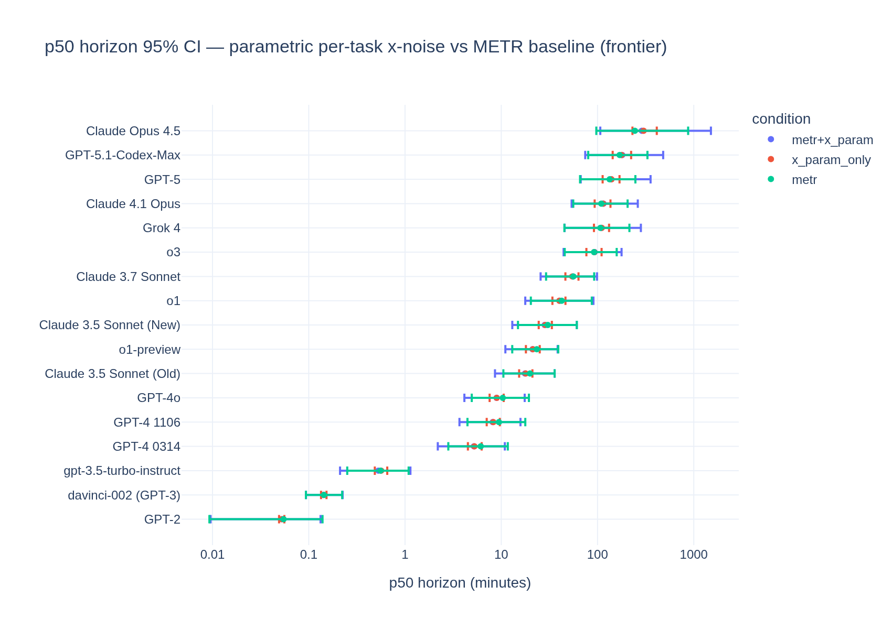

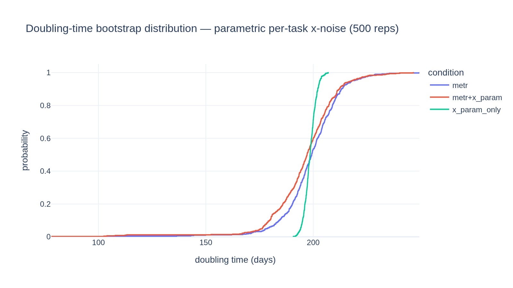

Code: [`a_parametric_xboot.py`](a_parametric_xboot.py) / [notebook](a_parametric_xboot.ipynb).
Outputs: [`data/a_ci_by_agent.csv`](data/a_ci_by_agent.csv),
[`data/a_doubling_times.csv`](data/a_doubling_times.csv).

## (c) — Coherent ±1σ shift (systematic-error worst case)

The bootstraps ((a0)/(a)) treat x-noise as *independent* across tasks, so it averages
out. A **systematic** error — every task biased the same direction (baseliner
selection, a shared convention, the flooring scheme) — does not. We bound it by shifting
*all* tasks' `human_minutes` coherently by $\pm 1\,\tilde\sigma_j$ in log space and
refitting (researcher-estimate tasks, which have no baseliner spread, shift by METR's
estimate-error σ = 1.05 — the same value (d) uses for them).

**Result: absolute horizons swing hugely; the doubling time barely moves.**

- A coherent ±1σ̃ bias multiplies the geometric-mean p50 horizon of the SOTA-at-release
  agents by **×2.29 / ×0.44**
  (16.4 min → 37.6 / 7.2 min): the *absolute* horizon is extremely sensitive to any
  systematic error in the baseline times.
- But the **doubling time** moves only **−7.0% / +8.1%** (201 → 187 / 217 days), because
  a coherent shift is nearly a uniform rescale, which slides log-horizons vertically
  without changing the slope. The small residual asymmetry is real: the shift is larger
  for the long HCAST/RE-Bench tasks than for short SWAA, so pushing all tasks *up*
  steepens the fitted slope slightly (faster doubling).
- The **p80/p50 ratio is preserved** (0.233–0.256 across scenarios) — a pure shift moves
  both quantiles by the same factor. This is the systematic-error counterpart to the
  errors-in-variables *attenuation* in (d), which instead widens the p50/p80 gap.

This is the quantitative hook for **Stage 4**: baseliner selection is precisely a
coherent shift, and (c) shows it would badly bias the absolute horizon claims while
sparing the doubling time.

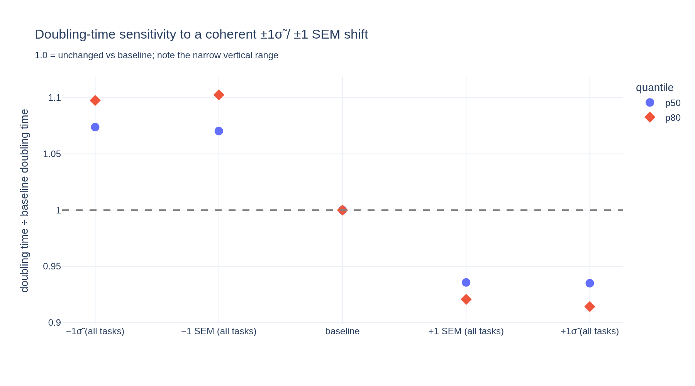

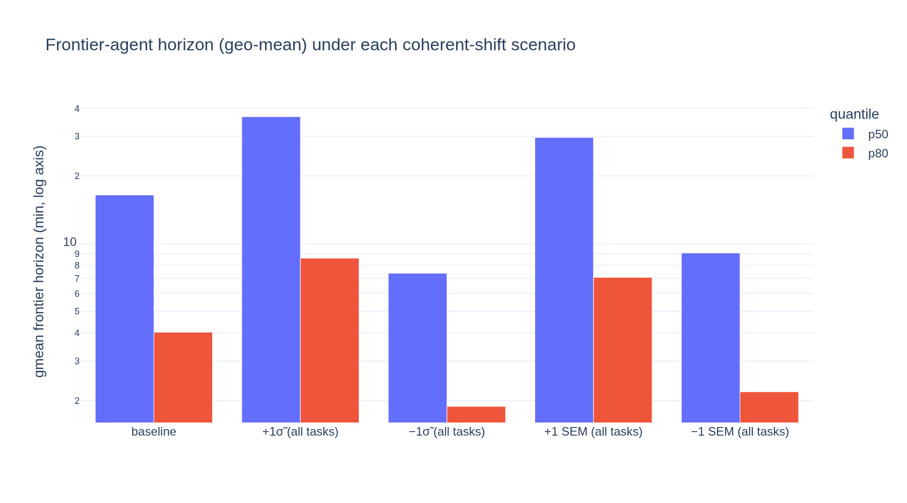

Code: [`c_coherent_shift.py`](c_coherent_shift.py) / [notebook](c_coherent_shift.ipynb).
Output: [`data/c_coherent_shift.csv`](data/c_coherent_shift.csv).

## (d) — SIMEX with per-task σ

Wider CIs aren't the whole story: x-noise *attenuates* the logistic slope, biasing the
horizon **point estimates**. SIMEX corrects it — add known noise at λ = 0.5…2, watch the
horizon drift, extrapolate to λ = −1 (zero noise). We run METR's own global-σ version and
our per-task-σ version through the same pipeline. (Validation: the λ=0 fits
reproduce METR's published p50/p80 exactly.)

The extrapolation back to λ = −1 is a modelling choice, and it turns out to be the
single largest lever in this analysis, so we compute two: a **quadratic** in λ (the
textbook default; the headline numbers below) and METR's **exponential** — their note
fits `horizon(λ)/horizon(0) = exp(β·λ)`, log-horizon linear in λ. The quadratic follows
the curve's curvature and extrapolates more aggressively; the difference is small for
p50 but roughly **halves the p80 rise** (both variants are in
[`data/d_simex_corrections.csv`](data/d_simex_corrections.csv)).

**Result 1: the correction is very uneven across agents — a median hides it.**

The mechanism is a *pivot*, not a shift. Attenuation flattens the fitted logistic slope;
undoing it **steepens** the curve, which pulls the 50% and 80% crossings closer together
about a point near the centre of each agent's data. So:

- **p80 rises for essentially every capable agent: +25% to +40%.** p80 always sits on the
  short-task side of p50, so steepening moves it up toward p50. This is the largest and
  most consistent effect in Stage 2.
- **p50 barely moves for most agents, and flips sign with capability.** It is +11 to +15%
  for the GPT-4-era middle of the pack, passes through zero around a ~100-minute horizon,
  and turns sharply negative only at the top: **−18.8% for Claude Opus 4.5**, the most
  capable agent in v1.0. The reason is that a weak agent's p50 sits *inside* the bulk of
  the task-length distribution (near the pivot, so it hardly moves), while Opus 4.5's p50
  of 247 minutes is out in the sparse right tail, far from the pivot and extrapolated —
  which is exactly where steepening the slope drags it down hard.

This is why the **median across agents is a misleading summary**: p50's median correction
is only +3.4%, but that is a near-cancellation of +15% at the middle against −19% at the
top, not an absence of effect. The figure below plots the correction per agent against that
agent's own uncorrected p50, which is the honest view.

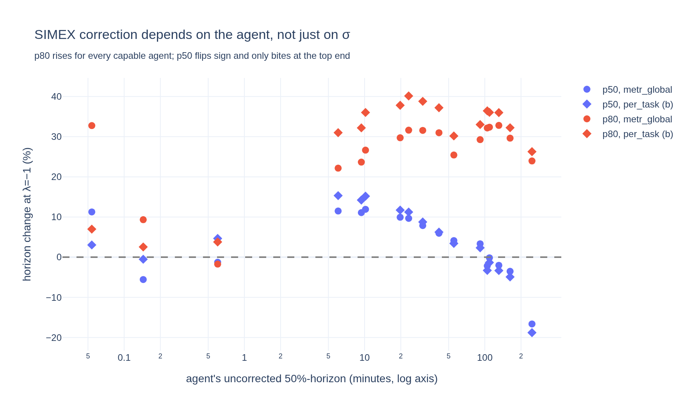

**Result 2: per-task σ makes the correction slightly *larger*, overturning our initial
guess.**

- For **Claude Opus 4.5**, SIMEX moves p50 **−16.6%** (global σ) → **−18.8%** (per-task σ),
  and p80 **+24.0% → +26.3%**.
- Median across the 17 SOTA-at-release agents: p50 +4.1% → +3.4%, p80 +29.6% → +33.0%
  (global → per-task). The reason is exactly the (b) finding: HCAST/RE-Bench noise
  ($\tilde\sigma \approx 0.89$) exceeds METR's global 0.78, and those are the long tasks
  that drive the top end. **So METR's published SIMEX, if anything, slightly *understates*
  the errors-in-variables correction — not overstates it, as we had hypothesised.**
- On **v1.1** the same pipeline lands close to METR's own published headline: Claude
  Opus 4.6 p50 **−33.8%** under their global σ *and* their exponential extrapolant,
  against their reported **−36%**. See [Extending to v1.1](#extending-to-v11) for the
  full comparison, including the p80 discrepancy.

Caveats: the extrapolant matters most for p80 — under METR's exponential, Opus 4.5's
p80 correction is +18.8% instead of the quadratic's +26.3%, and the median p80 rise
drops from +33.0% to +27.9% (per-task σ; the qualitative story — p80 up for every
capable agent, p50 down only at the top — is extrapolant-invariant). And SIMEX assumes
*independent* noise — the systematic component is (c).

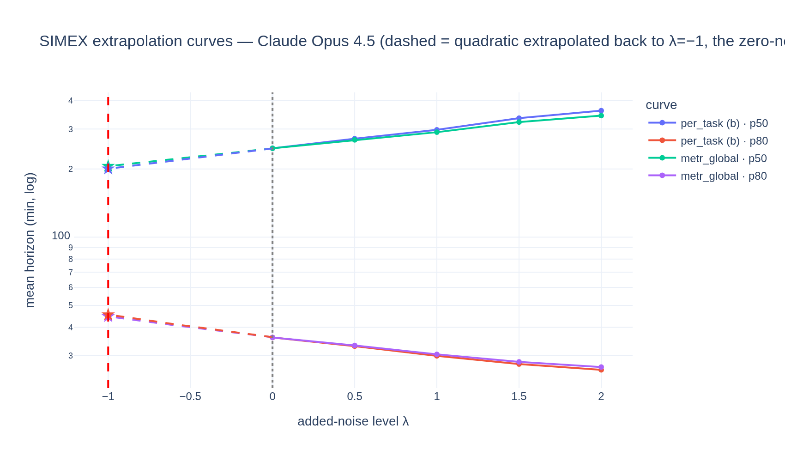

Code: [`d_simex.py`](d_simex.py) / [notebook](d_simex.ipynb). Outputs:
[`data/d_simex_curves.csv`](data/d_simex_curves.csv),
[`data/d_simex_corrections.csv`](data/d_simex_corrections.csv).

## Extending to v1.1

Rerunning the whole chain on **Time Horizon v1.1** (228 tasks; agents from GPT-4
(Mar 2023) onward; Inspect harness; 14 SOTA-at-release agents) —
`DATASET_VERSION=1-1 python {b,a,c,d}_*.py`, outputs suffixed
`_v1_1`. All Stage-2 conclusions carry over, and one new thing appears because v1.1
includes the agent METR itself reported on:

| | v1.0 (paper suite) | v1.1 (§7) |
|---|---|---|
| (b) HCAST prior | $d_0=\infty$, $\sigma\approx0.89$ (complete pooling) | $d_0=\infty$, **$\sigma\approx0.89$** — identical |
| (b) SWAA prior | $d_0\approx2.5$, $s_0\approx0.30$ | $d_0\approx2.5$, $s_0\approx0.30$ — identical |
| (a) median p50 interval widening | 13.6% | **12.4%** |
| (a) doubling-time CI (metr → metr+x) | 52.7 → 54.7 d, median ~flat | 54.2 → 57.0 d, **median 129 → 117 d** |
| (c) coherent ±1σ̃: horizon | ×2.29 / ×0.44 | ×2.56 / ×0.39 |
| (c) coherent ±1σ̃: doubling | −7.0% / +8.1% | **−2.5% / +2.8%** |
| (d) SIMEX newest agent p50, quadratic extrapolant (global / per-task σ) | Opus 4.5: −16.6 / −18.8% | **Opus 4.6: −34.3 / −35.9%** |
| (d) — same, METR's exponential extrapolant | −15.6 / −17.7% | −33.8 / −35.6% |
| (d) SIMEX median p80 across those agents, quadratic (global / per-task σ) | +29.6 / +33.0% | +37.4 / +43.2% |
| (d) — same, METR's exponential extrapolant | +24.5 / +27.9% | +32.9 / +37.4% |

Three takeaways:

1. **The (b) noise model is suite-invariant.** HCAST complete-pools to σ≈0.89 and SWAA to
   $s_0\approx0.30$ on *both* suites — the per-task σ estimates aren't an artifact of the paper's
   task selection.
2. **SIMEX comes close to METR's own headline — with one disclosed discrepancy.**
   v1.1's most capable agent is Claude Opus 4.6 — the very agent METR's note
   highlights. Under METR's global σ and their exponential extrapolant, our p50
   correction is **−33.8%** (11h59m → 7h43m); METR reported **−36%** (→ 7h38m). The
   p80 does not match as well: we get **+12.5%** on the same like-for-like basis (and
   +17.8% under our quadratic) against their published **+9%**. We could not close the
   remaining ~2-point p50 / ~3-point p80 gap — METR's SIMEX code and exact λ grid are
   unpublished, and their note's "regularization fix" fit may differ in detail from the
   headline fit we replicate — so read our pipeline as closely parallel to METR's, not
   as a re-execution of it. Our per-task σ again lands slightly deeper (p50 −35.6%
   exponential / −35.9% quadratic).
3. **The doubling time is *even more* robust on v1.1 under a coherent shift** (it moves
   only ±1.5% vs v1.0's ±7%), but the independent-noise bootstrap (a) pulls the
   doubling-time *median* down ~9% (129 → 117 d) — a larger central effect than v1.0's
   ~0%, because v1.1's wider horizon range gives x-noise more leverage on the slope. So
   v1.1 is the case where the x-axis most affects the doubling time, and it does so as a
   modest downward bias, not just added width.

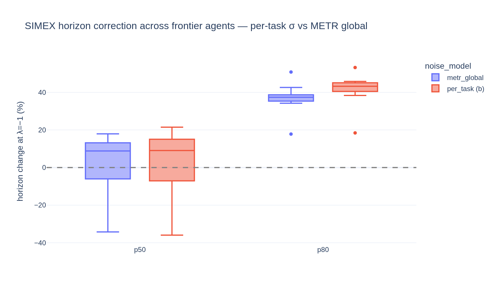

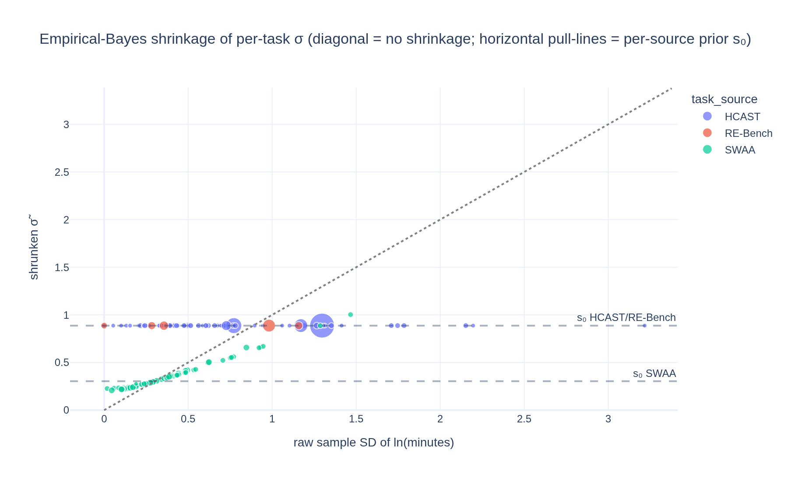

v1.1 figures/data carry the `_v1_1` suffix throughout `figures/` and `data/`. (a0 is not
rerun for v1.1 — the parametric (a) supersedes its lower bound.) The paired notebooks
render the v1.0 headline; rerun any `.py` with `DATASET_VERSION=1-1` to regenerate v1.1.
