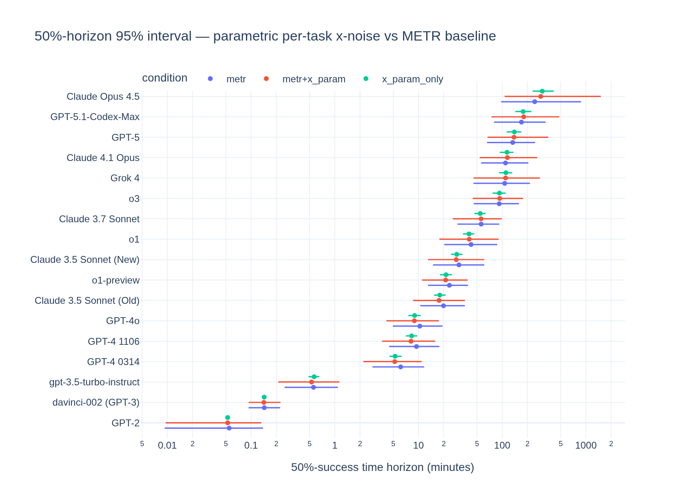
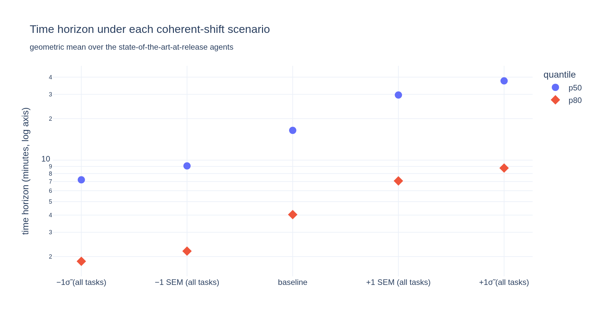
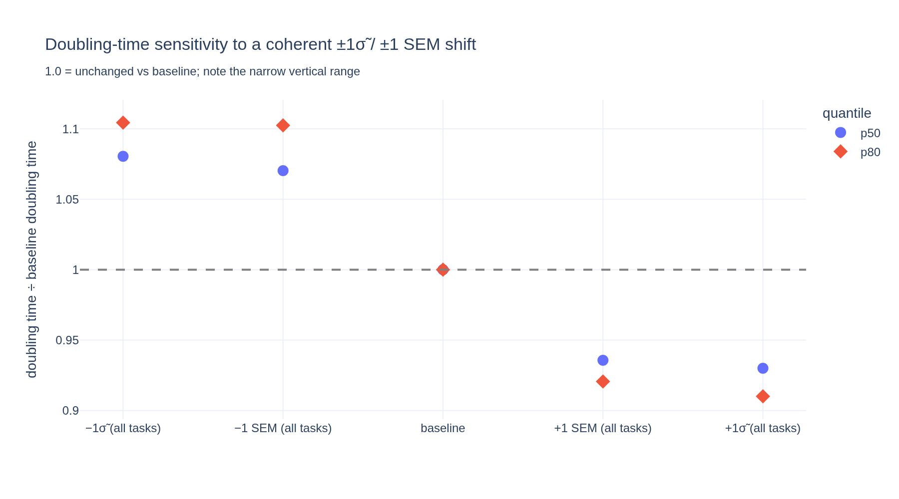
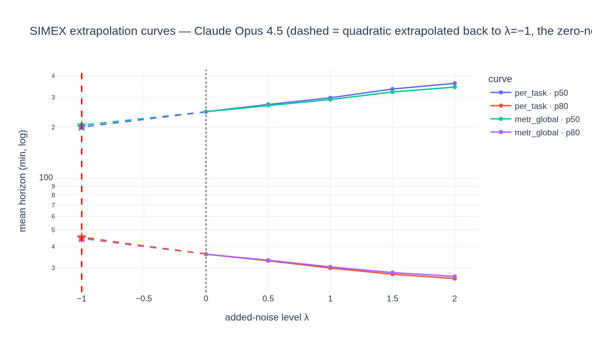
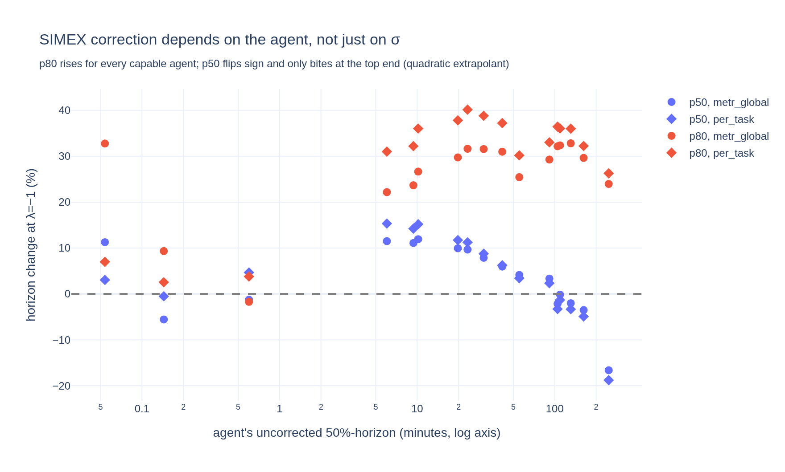

# Stage 2 — Measurement error in `human_minutes`

METR's methodology treats each task's `human_minutes` — how long the task takes a human expert — as an exact number known precisely. But this isn't true. There is uncertainty: for most tasks it is the geometric mean of a handful of noisy human attempts, and for some tasks it is a researcher's estimate. Even METR's bootstrap confidence intervals hold `human_minutes` fixed in every replicate, so the x-axis contributes nothing to their published uncertainty. This stage measures that missing uncertainty and pushes it through to the headline results, in four sub-analyses:

| analysis                                                             | question it answers                                                              |
| -------------------------------------------------------------------- | -------------------------------------------------------------------------------- |
| [Per-task σ](#per-task-σ-via-empirical-bayes-shrinkage)              | How noisy is each task's measured human time?                                    |
| [Parametric x-bootstrap](#parametric-x-bootstrap)                    | How much wider do the confidence intervals get once the x-axis is uncertain too? |
| [Coherent ±1σ shift](#coherent-1σ-shift-a-systematic-error-scenario) | What if all baseline times share one systematic bias?                            |
| [SIMEX](#simex-with-per-task-σ)                                      | How much does x-noise bias the fitted horizons themselves?                       |

## Bottom line

Uncertainty in the human baseline times matters a lot for the *absolute* time horizons and very little for the *doubling time*:

- **The absolute horizons are fragile.** If the baseline times share a systematic bias — every task measured against humans who were uniformly faster or slower than the reference population — the headline horizon moves by a factor of about 2.3 in either direction under a bias the size of one per-task σ̃. The published horizon numbers depend on there being no such shared bias.
- **The doubling time is robust.** Independent per-task noise averages out across the 170 tasks (it widens the doubling-time confidence interval by only about 2 days), and a systematic bias of that same size moves the doubling time by about 10% at most, because rescaling every task's time shifts the fitted line up or down without changing its slope.
- **Even zero-mean noise in the baseline times biases the fitted curves; SIMEX estimates the size of that bias.** Noise in a regression's x-values flattens the fitted success curves (errors-in-variables attenuation), which distorts the horizons estimated from them even when the noise has no systematic direction. The SIMEX correction differs sharply by agent: the 80%-horizon rises 25–40% for essentially every capable agent, while the 50%-horizon barely moves for mid-pack agents and drops for the most capable one (−19% for Claude Opus 4.5).
- **METR assumed slightly too little noise, not too much.** Our per-task noise estimates come out a bit above METR's global assumption on the long tasks that drive the top-end horizons — so METR's published SIMEX correction slightly understates the effect.

## Scope and conventions

METR's doubling time is fitted over the agents that were state of the art *on their release date* (the running maximum of the 50%-horizon), which METR's code calls the *frontier* set. These models are no longer frontier — v1.0's most capable member is Claude Opus 4.5 and v1.1's is Claude Opus 4.6 — so below we call them the *SOTA-at-release* agents (17 on v1.0, 14 on v1.1) and name the newest one explicitly wherever it carries the headline. This set is held fixed at METR's published membership even under corrected x-axes, for comparability (a large enough correction could in principle change who was SOTA at release).

All sub-analyses share the fit machinery in [`metr_fit_helpers.py`](metr_fit_helpers.py), which reproduces METR's published p50/p80 exactly.

Everything below is on **Time Horizon v1.0** (the paper's suite). The whole chain also runs on **v1.1** (228 tasks; agents from GPT-4 (Mar 2023) onward; Inspect harness) via `DATASET_VERSION=1-1` — see [Extending to v1.1](#extending-to-v11) at the end, which under METR's own extrapolant comes within 3 percentage points of their published Opus 4.6 SIMEX headline (−33.8% vs −36%).

## Per-task σ via empirical-Bayes shrinkage

Everything downstream needs to know how noisy each task's measured human time is: the spread σ of log completion time across the humans who attempted the task. The obstacle is sample size. Most tasks have only two to four successful baseline runs, and 21 tasks have exactly one, where no spread is observable at all. The solution is to apply some prior to the variance.

The model is a standard Bayesian hierarchical one: each task's true variance is drawn from a shared scaled inverse-$\chi^2$ prior — the conjugate prior for a normal variance — with strength $d_0$ (in pseudo-observations) and typical value $s_0^2$. The empirical-Bayes twist is that the prior is not estimated jointly with the rest of the model: it is fitted first, by method of moments across the whole ensemble of tasks,[^moments] after which each task gets a closed-form posterior estimate. This is the *limma/eBayes* moderated-variance estimator (Smyth 2004), the standard tool wherever many variances must each be estimated from two or three observations. Each task's estimate then blends its own observed variance $s_j^2$ (with $d_j = n_j - 1$ degrees of freedom) with the prior:

$$\tilde\sigma_j^2 \;=\; \frac{d_0\,s_0^2 \;+\; d_j\,s_j^2}{d_0 + d_j}$$

Tasks with many runs keep roughly their own estimate, tasks with two or three runs are pulled toward the prior, and single-run tasks get exactly the prior value $s_0$. The prior is fitted separately per task source, because the sources differ a lot:

The fit gives:

| task source                                   | prior strength $d_0$ | prior σ $s_0$ | reading                                                                                                                                 |
| --------------------------------------------- | -------------------- | ------------- | --------------------------------------------------------------------------------------------------------------------------------------- |
| HCAST (RE-Bench borrows this prior[^rebench]) | ∞ — complete pooling | 0.89          | with 2–4 runs per task, the data cannot distinguish task-to-task differences in σ from sampling noise; one common σ explains everything |
| SWAA                                          | ≈ 2.5                | 0.30          | genuine task-to-task differences, around a much smaller typical σ                                                                       |

The comparison that matters is against METR's own noise assumption. Their [modelling-assumptions note](https://metr.org/notes/2026-03-20-impact-of-modelling-assumptions-on-time-horizon-results/) used a single global σ of 0.78 for all baselined tasks. Our per-task estimates say that is roughly right for the tasks that matter, and if anything slightly low. The raw sample spreads look smaller than 0.78 at the median, but that is a small-sample artifact — with two to four runs, the sample standard deviation badly underestimates the true σ. Once that bias is removed, HCAST's common σ comes out at about 0.89, a little *above* METR's 0.78. SWAA is far quieter than 0.78, but its tasks take seconds to minutes and barely influence the top-end horizons. Researcher-estimate tasks have no baseline runs at all; for them we carry METR's assumed estimate-error σ of 1.05.[^freecheck]

The shrinkage in action — raw spreads on the x-axis, the estimates the rest of the analysis uses on the y-axis:

Two robustness checks, in brief (both in full in [the notebook](sigma_task.ipynb)): the complete-pooling result sits on a boundary of the parameter space, but a bootstrap shows that plausible finite priors barely change the σ estimates the downstream analyses consume; and the within-task log-normality assumption, where testable, fails in the direction of *heavier* tails — which would push the fit further toward pooling, not away from it. The honest cost of heavy tails is that σ̃/√n slightly understates the uncertainty of a small-sample mean, which is why the bootstrap below keeps an assumption-free floor.

Further figures: [spread vs task length](figures/sigma_vs_length.png) · [per-task SEM vs METR's global assumption](figures/sigma_sem_vs_metr.png) · [within-task normality](figures/sigma_within_task_normality.png)

Code: [`sigma_task.py`](sigma_task.py) (jupytext; paired executed notebook [`sigma_task.ipynb`](sigma_task.ipynb)). Output: [`data/sigma_by_task.csv`](data/sigma_by_task.csv) — every task's raw and shrunken σ and the standard error of its `human_minutes`.

[^moments]: The hyperparameters are estimated by method of moments on $\log s_j^2$: its observed dispersion across tasks decomposes into known $\chi^2$ sampling noise (trigamma functions of the $d_j$) plus true between-task spread (a trigamma function of $d_0$); if sampling noise already explains all the observed dispersion, the fit returns $d_0 = \infty$. One task with four identical recorded times ($s_j = 0$ exactly) is excluded from the moment fit but still shrunk like every other task.

[^rebench]: RE-Bench has only 7 tasks with observable spread — too few for a stable fit of its own — and its long, open-ended research tasks resemble HCAST far more than the seconds-scale SWAA tasks.

[^freecheck]: A free sanity check: three RE-Bench estimate tasks also have successful runs in the export, so the estimate can be compared with actual times. The estimate errors are small next to σ = 1.05, but with three tasks, all of whose "estimates" are exactly the 480-minute session budget, this is indicative only.

## Parametric x-bootstrap

METR's published confidence intervals come from a hierarchical bootstrap over task families, tasks, and agent runs — with `human_minutes` held fixed. We add the missing level in two passes, both running 500 replicates through METR's own fit code, so the comparison against their intervals is like for like.

**Pass 1 — an assumption-free floor.** First we resample only what the data supports directly: *which successful baseline runs* enter each task's geometric mean, using the per-run times recovered in [Stage 1](../stage-1-export-archaeology/). This needs no distributional assumptions, but it can only perturb the 126 of 170 tasks that have at least two successful runs. The frozen remainder — single-run tasks, researcher estimates, RE-Bench — are disproportionately the *long* tasks, so this pass is a lower bound. The effect is small: per-agent 50%-horizon intervals widen by a median of about 4 percent, and the doubling-time interval is essentially unchanged (the pure x-axis contribution to its spread is about ±2 days). Figures: [interval comparison](figures/xboot_nonparam_ci_comparison.png) · [doubling-time distribution](figures/xboot_nonparam_doubling_time.png)

**Pass 2 — the parametric bootstrap.** Using the per-task σ from the previous section, every task's `human_minutes` is redrawn each replicate from a lognormal centred on the published value — so the long tasks the floor had to freeze now carry uncertainty too. The widening roughly triples, to a median of about 14 percent, and almost all of the increase comes from those previously frozen long tasks:

The doubling time, however, still barely notices: its 95% interval grows by only about two days even with every task perturbed at its full estimated noise ([distribution](figures/xboot_param_doubling_time.png)). Independent errors average out across 170 tasks. What does *not* average out is an error shared by all tasks at once — the next section.

Code: [`xboot.py`](xboot.py) / [notebook](xboot.ipynb). Outputs: per-agent intervals and doubling-time draws for both passes in [`data/`](data/) (`xboot_nonparam_*`, `xboot_param_*`).

## Coherent ±1σ shift (a systematic-error scenario)

If every task's human time is biased in the same direction — because the baseliners METR could recruit were uniformly faster or slower than the intended reference population, or because of a shared convention in how attempts were timed — then no amount of averaging helps. To see how much this could matter, we shift *every* task's `human_minutes` up (or down) by one full per-task σ̃ and refit everything.

This is a scenario, not a bound: it asks what happens if the baseline times are systematically wrong by their entire typical person-to-person spread. The ±1σ̃ magnitude is illustrative — between-person spread is a natural yardstick for the size of a coherent bias, not an estimate or bound of it, and a shared bias could be smaller or larger. The answer splits sharply:

| scenario                   | 50%-horizon (geo-mean over SOTA-at-release agents) | doubling time |
| -------------------------- | -------------------------------------------------- | ------------- |
| all tasks shifted down 1σ̃ | 7.2 min                                            | 217 days      |
| published                  | 16.4 min                                           | 201 days      |
| all tasks shifted up 1σ̃   | 37.6 min                                           | 187 days      |

The absolute horizon swings by a factor of about 2.3 in each direction — it is fully exposed to any systematic error in the baselines. The doubling time moves by well under a tenth even under the full ±1σ̃ shift, because shifting every task by a similar factor slides the horizon-versus-date line up or down without much changing its slope. The small movement that does occur comes from the shift not being perfectly uniform: long HCAST and RE-Bench tasks shift more than short SWAA tasks.

Two footnotes to this result. The 80%-horizon behaves just like the 50%-horizon (the ratio between them is preserved under a coherent shift), in contrast to SIMEX below, where the two move differently. And this analysis is the quantitative hook for [Stage 4](../stage-4-cohort-selection/): baseliner selection is precisely a coherent shift, so it would badly bias the absolute horizon claims while sparing the doubling time.

Code: [`coherent_shift.py`](coherent_shift.py) / [notebook](coherent_shift.ipynb). Output: [`data/coherent_shift.csv`](data/coherent_shift.csv).

## SIMEX with per-task σ

Wider intervals are not the whole story. Noise in a regression's x-values flattens the fitted curve — errors-in-variables attenuation — so the fitted success curves, and the horizons read off them, are *biased* even when the noise itself has no direction. SIMEX (simulation–extrapolation) estimates that bias by turning the knob the only way it can be turned: add *extra* noise at several known multiples of the estimated noise level, watch how the fitted horizons degrade, and extrapolate the trend backwards to the hypothetical zero-noise fit.

The extrapolation is a modelling choice, and it turns out to be the largest single lever in this analysis. We compute two variants: a **quadratic** in the added-noise level (a common default, and our headline), and the **exponential** form METR's note used, which is more conservative. The choice matters little for the 50%-horizon but roughly halves the 80%-horizon correction; both variants are carried through all outputs.

**The correction differs sharply by agent, so no single number summarizes it.** Undoing attenuation steepens each agent's fitted success curve, pivoting it about a point near the centre of the task distribution. The 80%-horizon sits below that pivot, so it rises for essentially every capable agent — by 25 to 40 percent, the largest and most consistent effect in this stage. The 50%-horizon of a mid-pack agent sits near the pivot and barely moves; but the most capable agent's 50%-horizon sits far out in the sparse right tail of the task distribution, where steepening the curve drags it down hard. For Claude Opus 4.5 the 50%-horizon falls by 19 percent.

**Per-task σ makes the correction slightly larger than METR's global σ, not smaller.** This follows directly from the σ analysis: the long HCAST and RE-Bench tasks that drive the top end are a touch noisier than METR's assumed 0.78. So METR's published SIMEX correction, if anything, slightly understates the errors-in-variables effect:

| SIMEX correction (quadratic extrapolant)   | METR's global σ | our per-task σ |
| ------------------------------------------ | --------------- | -------------- |
| Claude Opus 4.5, 50%-horizon               | −16.6%          | −18.8%         |
| Claude Opus 4.5, 80%-horizon               | +24.0%          | +26.3%         |
| median 50%-horizon, SOTA-at-release agents | +4.1%           | +3.4%          |
| median 80%-horizon, same                   | +29.6%          | +33.0%         |

One caveat carries real weight: SIMEX assumes the noise is *independent* across tasks. The systematic component is what the coherent-shift scenario above explores instead.

Code: [`simex.py`](simex.py) / [notebook](simex.ipynb). Outputs: [`data/simex_curves.csv`](data/simex_curves.csv), [`data/simex_corrections.csv`](data/simex_corrections.csv).

## Extending to v1.1

Rerunning the whole chain on **Time Horizon v1.1** — the newer suite, with 228 tasks, agents from GPT-4 (March 2023) onward, and the Inspect harness — takes one command per script: `DATASET_VERSION=1-1 python <script>.py`, with outputs suffixed `_v1_1`. All Stage-2 conclusions carry over, and one new comparison appears, because v1.1 includes the agent METR itself reported SIMEX results for:

|                                                                       | v1.0 (paper suite)                                   | v1.1                                              |
| --------------------------------------------------------------------- | ---------------------------------------------------- | ------------------------------------------------- |
| σ: HCAST prior                                                        | $d_0=\infty$, $\sigma\approx0.89$ (complete pooling) | $d_0=\infty$, **$\sigma\approx0.89$** — identical |
| σ: SWAA prior                                                         | $d_0\approx2.5$, $s_0\approx0.30$                    | $d_0\approx2.5$, $s_0\approx0.30$ — identical     |
| x-bootstrap: nonparametric-floor median p50 widening                  | 3.8%                                                 | **1.0%**                                          |
| x-bootstrap: parametric median p50 widening                           | 13.6%                                                | **12.4%**                                         |
| x-bootstrap: doubling-time CI (metr → metr+x_param)                   | 52.7 → 54.7 d, median ~flat                          | 54.2 → 57.0 d, **median 129 → 117 d**             |
| coherent ±1σ̃: horizon                                                | ×2.29 / ×0.44                                        | ×2.56 / ×0.39                                     |
| coherent ±1σ̃: doubling                                               | −7.0% / +8.1%                                        | **−2.5% / +2.8%**                                 |
| SIMEX newest agent p50, quadratic extrapolant (global / per-task σ)   | Opus 4.5: −16.6 / −18.8%                             | **Opus 4.6: −34.3 / −35.9%**                      |
| — same, METR's exponential extrapolant                                | −15.6 / −17.7%                                       | −33.8 / −35.6%                                    |
| SIMEX median p80 across those agents, quadratic (global / per-task σ) | +29.6 / +33.0%                                       | +37.4 / +43.2%                                    |
| — same, METR's exponential extrapolant                                | +24.5 / +27.9%                                       | +32.9 / +37.4%                                    |

Three takeaways:

1. **The σ noise model is suite-invariant.** Both priors come out the same on v1.1 as on v1.0: HCAST complete-pools to the same common σ, and SWAA to the same smaller-but-varied prior. The per-task σ estimates are not an artifact of the paper's task selection.
2. **SIMEX comes close to METR's own headline, with one disclosed discrepancy.** v1.1's most capable agent is Claude Opus 4.6 — the very agent METR's note highlights. On a like-for-like basis (their global σ, their exponential extrapolant), our 50%-horizon correction is −34% against their reported −36%. The 80% horizon matches less well: we get +12% against their published +9%, and more under our quadratic extrapolant. We could not close the remaining gap — METR's SIMEX code and exact settings are unpublished — so read our pipeline as closely parallel to METR's, not as a re-execution of it. Our per-task σ again pushes the corrections slightly deeper than the global σ does.
3. **v1.1 is the suite where the x-axis most affects the doubling time.** Under a coherent shift the doubling time is even more stable than on v1.0. But the parametric x-bootstrap, which barely moved the central doubling time on v1.0, now pulls its median down by about 9% — v1.1 spans a wider range of horizons, which gives x-noise more leverage on the slope. So on v1.1, measurement error adds a modest downward bias to the doubling time, not just extra width.

v1.1 figures and data carry the `_v1_1` suffix throughout [`figures/`](figures/) and [`data/`](data/) — e.g. [the v1.1 SIMEX per-agent correction](figures/simex_correction_v1_1.png) and [the v1.1 shrinkage](figures/sigma_shrinkage_v1_1.png). The paired notebooks render the v1.0 headline; rerun any `.py` with `DATASET_VERSION=1-1` to regenerate v1.1.
