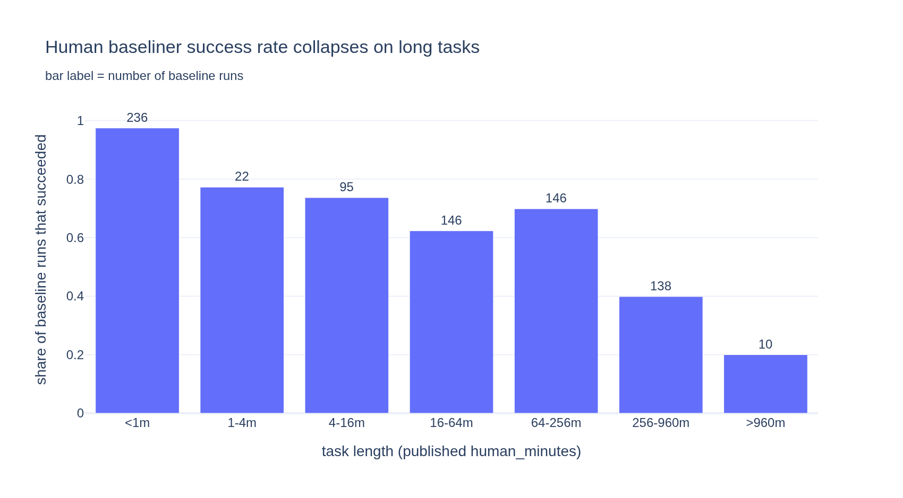
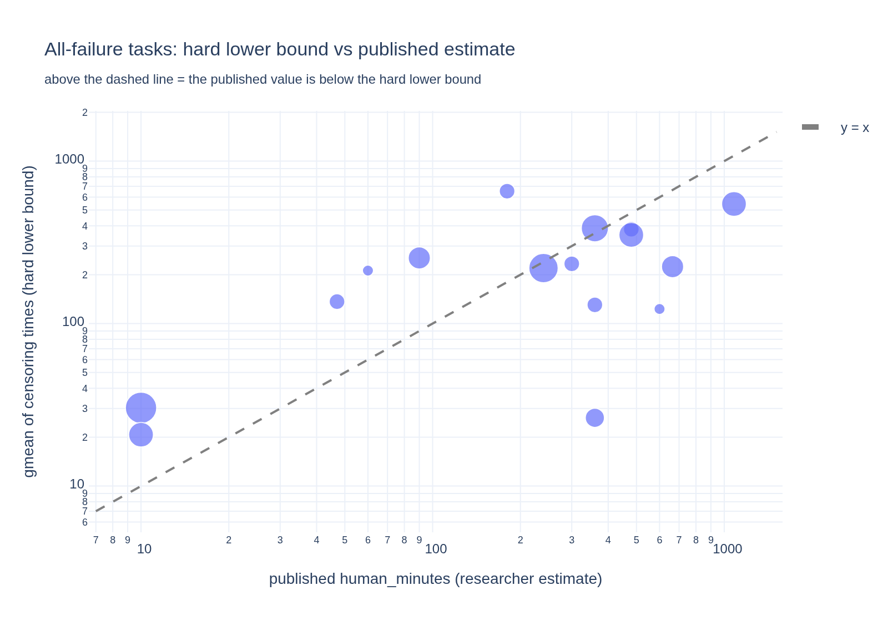
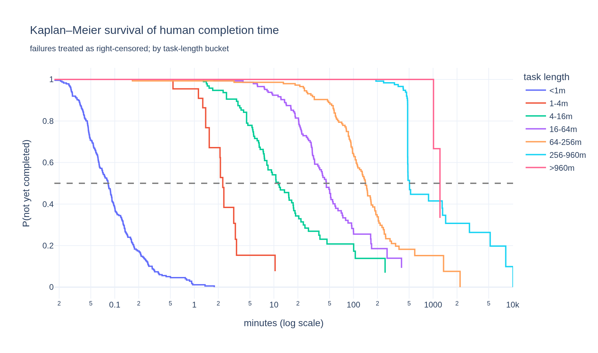
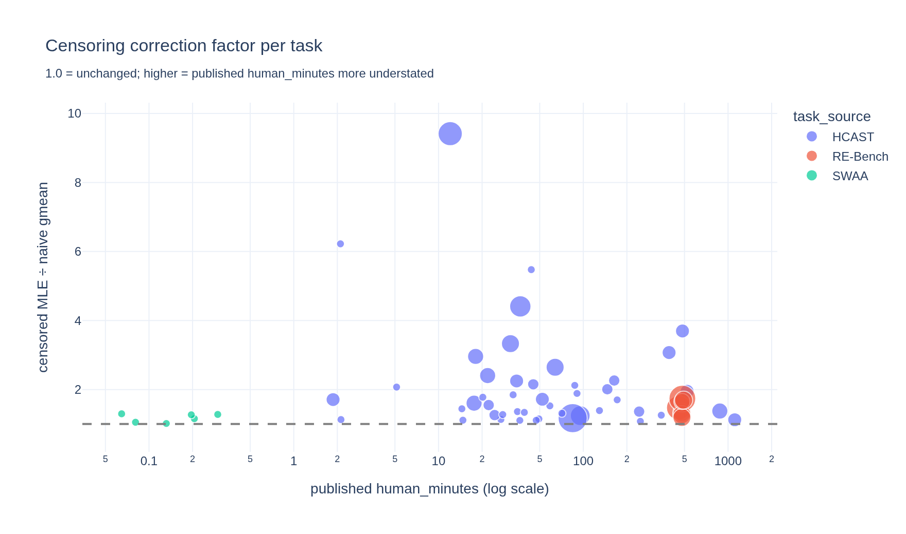
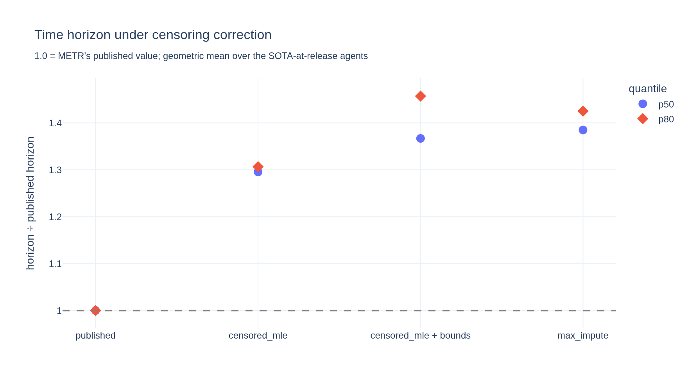
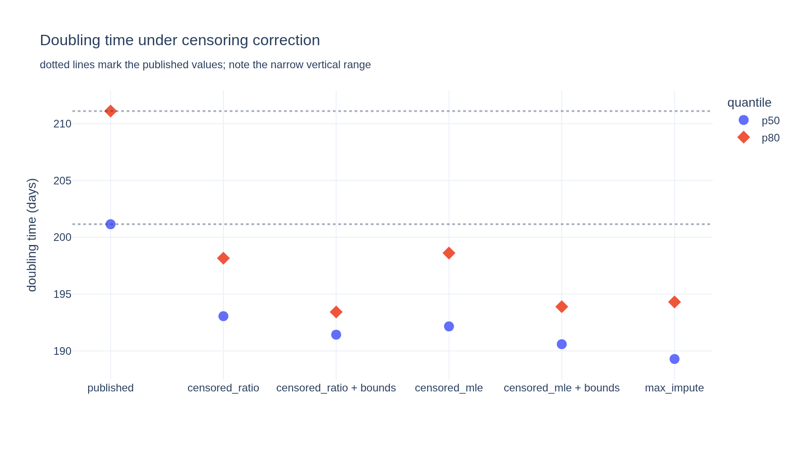

# Stage 3 — Failed human baselines as right-censored observations

`human_minutes` is the geometric mean of the completion times of the baseliners who
**succeeded**. The ones who failed are dropped — but the export still records how long
they worked. A failure after 8 hours is not missing data. It is the observation
**"this person's completion time exceeds 8 hours"**: a textbook **right-censored**
observation.

Discarding them is complete-case analysis of censored data, which biases the estimate
*downwards*, because the discarded attempts are precisely the slow ones. This correction
has not been done before: METR's
[limitations note](https://metr.org/notes/2026-01-22-time-horizon-limitations/) lists it
as open, and the existing Weibull survival work in this space models *agent* runs, not
human baselines.

Three escalating tiers:

| tier | method | assumption |
|---|---|---|
| 1 | **hard bounds** — the geometric mean of censoring times bounds the true one from below | none |
| 2 | **Kaplan–Meier** — nonparametric survival of completion time | non-informative censoring |
| 3 | **censored-lognormal MLE**, σ̃ from [Stage 2's σ analysis](../stage-2-measurement-error/) | lognormal, σ known |

## Bottom line

Failed baselines are ~28% of all human runs, concentrated on exactly the long tasks
that set the top-end horizons. Correcting for them raises absolute horizons by ~28–47%
across scenarios — the most capable agent's p50 by ~35% under the pure-censoring
variant — while shortening the doubling time by only 4–5%. Set against METR's own SIMEX
correction, which pushes the opposite way, the net revision to the newest agent's p50
is **+10…+18% on v1.0 and −21…−25% on v1.1**: the two largest known x-axis corrections
substantially cancel, and the sign of what remains depends on the task suite. Along the
way, a structural fact about the data: the researcher-"estimate" tasks are *exactly*
the tasks where every baseliner failed, and for 7 of those 16 the recorded failed
attempts already prove the published value is too low.

## How much censoring is there?

**226 of 793 baseline runs (28.5%) ended in failure** — 38% of HCAST and 48% of RE-Bench
runs, versus 2.6% of SWAA. The censoring times are long, not quick give-ups: median 145
min, 95th percentile 690 min, max 7,597 min (5.3 days). **1,277 hours of recorded human
effort** is discarded — 388 of those hours on the 16 tasks discussed below, where *every*
baseliner failed. 25 runs sit at exactly 479 minutes: a visible **8-hour administrative
cap**.

And the censoring is concentrated exactly where it does the most damage: human success
rate falls from 97.5% on sub-minute tasks to **39.9%** at 256–960 min and **20%** beyond
960 min. The long tasks that determine the top-end horizons are the ones whose
`human_minutes` rests on the most heavily filtered data.

## The structural finding: "estimate" tasks *are* the all-failure tasks

16 tasks have **zero** successful baseline runs. That set is **exactly** the set of HCAST
tasks whose `human_minutes` carries `human_source == "estimate"` — the correspondence is
one-to-one in both directions. METR fell back to a researcher's guess precisely when
*every* baseliner failed.

This reframes those tasks. They are not tasks that happened to lack baselines; they are
tasks humans **could not finish**, and the export contains the record of how long people
tried before giving up. 8.5% of all agent runs are scored against these 16 guesses.

## Tier 1 — the published numbers are provably too low (no model needed)

If every baseliner failed at times $c_1 \dots c_n$, then each true completion time
satisfies $T_i > c_i$, so $\operatorname{gmean}(T) > \operatorname{gmean}(c)$. That is
arithmetic, not modelling, and it can be checked against the published value:

- **7 of the 16** all-failure tasks have a published `human_minutes` **below** this hard
  lower bound — provably too low, by a median factor of **2.9×**.
- **13 of 16** have at least one single baseliner who worked longer than the published
  estimate without solving the task.
- Worst case `blackbox/apron`: published estimate **10 minutes**, while 8 baseliners
  failed, one after **368 minutes**. The bound alone puts it at ≥30 min (3.0× the
  estimate).

## Tier 2 — Kaplan–Meier

Treating failures as right-censored and pooling within task-length buckets, the KM median
runs **~1.5× the naive geometric mean of successes** in the well-populated middle buckets
(4–16 m: 1.35×, 16–64 m: 1.54×, 64–256 m: 1.49×). This is a distribution-free
corroboration of the parametric correction below. (The 256–960 m bucket dips below 1.0
because pooling spans a 4× range of true task lengths — read these as coarse checks, not
per-task estimates.)

## Tier 3 — censored-lognormal MLE

For a per-task point estimate, model completion time as lognormal and take **σ from
Stage 2's σ analysis** — which is what makes this tractable: with σ known, μ is a
one-parameter fit,
stable even on a task with one success and several censored runs. The censored terms can
only push μ up, so the correction is one-directional by construction.

**Correction factor (MLE ÷ naive geometric mean) across the 59 correctable tasks: median 1.47×,
75th pct 2.04×, max 9.4×.** On tasks longer than 60 minutes the corrected `human_minutes`
is **1.41–1.50×** the published value.

The extreme case is instructive. `blackbox/acorn` publishes **12.0 minutes** — the time of
its *single* successful baseliner — while **six of its nine failed baseliners worked
longer than 12 minutes** without solving it. No model is needed to see that 12 minutes is
wrong; the MLE's 113 minutes is one defensible answer.

Note the identifiability limit: with **no** successes the likelihood rises without bound
in μ, so the 16 all-failure tasks have no MLE. For them Tier 1's arithmetic floor is all
the data supports.

## Propagating to horizons and the doubling time

Six x-axis scenarios through METR's own weighted-logistic fit (the `published` scenario
reproduces their headline p50/p80 exactly; the SOTA-at-release agent set is held fixed
at METR's published membership throughout):

| scenario | p50, geo-mean over SOTA-at-release agents | p80, same | Claude Opus 4.5 p50 | doubling time |
|---|---|---|---|---|
| `published` | 16.4 min | 4.0 min | 246.8 min | 201.1 d |
| `censored_ratio` | ×1.28 | ×1.32 | ×1.36 | 193.1 d (−4.0%) |
| `censored_ratio + bounds` | ×1.35 | ×1.47 | ×1.35 | 191.4 d (−4.8%) |
| `censored_mle` | ×1.30 | ×1.31 | ×1.47 | 192.2 d (−4.5%) |
| `censored_mle + bounds` | ×1.37 | ×1.46 | ×1.45 | 190.6 d (−5.2%) |
| `max_impute` (crude) | ×1.39 | ×1.43 | ×1.59 | 189.3 d (−5.9%) |

The two `censored_*` families differ in how the Tier-3 fit is applied, and the
difference only matters for RE-Bench. `censored_mle` substitutes the MLE **level** —
the corrected gmean of elapsed completion times. For HCAST and SWAA that is exactly the
published convention (Stage 1), but RE-Bench's published `human_minutes` is *not* a
gmean of elapsed times (8h-capped sessions, Stage 1 §1), so substituting the elapsed-time
MLE there bundles the censoring correction with a **convention switch** — its ×1.47 on
Opus 4.5 is not purely a censoring effect. `censored_ratio` instead multiplies each
published value by the task's censoring **factor** (MLE ÷ naive gmean of successes),
keeping every task in its published convention: the pure-censoring number is **×1.36**.
Both are shown because both questions are legitimate — "what does censoring alone do?"
(ratio) and "what would a fully elapsed-time-consistent x-axis look like?" (level).

**Horizons rise ~28–47% across scenarios; the most capable agent's p50 rises ~35%
(pure censoring) to ~45% (elapsed-time-consistent)** — Claude Opus 4.5: 247 → 333–357
min. The doubling time *shortens* by 4–5% (201 → 191–193 days) — long tasks stretch
more than short ones, so recent agents gain more than old ones and the fitted slope
steepens slightly. Consistent with Stage 2: the x-axis moves levels far more than it
moves the doubling time.

## How much rides on the borrowed σ?

σ is the one parameter Tier 3 imports rather than estimates. Rescaling it 0.75× / 1× /
1.5× (HCAST $\tilde\sigma$ = 0.67 / 0.89 / 1.33) moves the p50 correction to
**×1.25 / ×1.30 / ×1.41**. The correction *grows* with σ: a wider distribution makes each
exact success weaker evidence about the location, so the censored observations dominate
more.

That direction matters for reading the headline. σ̃ is estimated from **successful** runs
only, so if failures are drawn from a heavier-tailed part of the distribution the true σ
is *larger* than 0.89 — making our central estimate the **conservative** one.

## Net effect: censoring correction vs SIMEX

These are the two largest known x-axis corrections and they point in **opposite
directions**. Applying both — the first time that has been done — to each suite's most
capable agent, with the censoring correction in both variants:

| correction on most-capable-agent p50 | v1.0 (Claude Opus 4.5) | v1.1 (Claude Opus 4.6) |
|---|---|---|
| SIMEX errors-in-variables ([Stage 2](../stage-2-measurement-error/), per-task σ) | ×0.812 (−18.8%) | ×0.641 (−35.9%) |
| censoring, pure (`censored_ratio + bounds`) | ×1.349 (+34.9%) | ×1.171 (+17.1%) |
| **→ net** | **×1.096 (+9.6%)** | **×0.750 (−25.0%)** |
| censoring, elapsed-time-consistent (`censored_mle + bounds`) | ×1.447 (+44.7%) | ×1.227 (+22.7%) |
| **→ net** | **×1.175 (+17.5%)** | **×0.786 (−21.4%)** |

(The multiplicative composition assumes the two corrections commute; SIMEX rerun on a
censoring-corrected x-axis, with σ re-estimated from it, would come out somewhat
different. Read the net as indicative, not as a precise revised headline.)

**The two corrections are of comparable size and substantially cancel — but the sign of
what is left over is not robust.** On v1.0 the censoring correction wins and the headline
p50 should be revised *up* 10–18%; on v1.1, where SIMEX bites much harder (−36%, close to
METR's own published figure), SIMEX wins and the net is *down* 21–25%.

The defensible claim is therefore not a specific net number but this: **METR's published
SIMEX haircut is not the end of the story.** It is opposed by a correction of similar
magnitude that has never been applied, and once both are in play the residual uncertainty
in the headline horizon is roughly ±20% with a suite-dependent sign. Reporting the SIMEX
haircut alone overstates how confidently the horizon should be revised downward.

## Extending to v1.1

`DATASET_VERSION=1-1` reruns everything on the 228-task v1.1 suite (agents from GPT-4
onward). Every qualitative finding carries over, including the structural one:

| | v1.0 | v1.1 |
|---|---|---|
| censoring rate | 226/793 (28.5%) | 216/773 (27.9%) |
| all-failure tasks | 16 | 23 |
| …identical to the HCAST `estimate` set? | **yes** | **yes** |
| provably understated (Tier 1) | 7/16, median 2.9× | 10/23, median 2.44× |
| Tier-3 correction factor (median) | 1.47× | 1.54× |
| p50, geo-mean over SOTA-at-release agents (mle+bounds / ratio+bounds) | ×1.37 / ×1.35 | ×1.27 / ×1.26 |
| most-capable-agent p50 (mle+bounds / ratio+bounds) | ×1.45 / ×1.35 | ×1.23 / ×1.17 |
| doubling time (mle+bounds / ratio+bounds) | −5.2% / −4.8% | −1.8% / −1.4% |
| σ sensitivity (0.75/1/1.5×) | ×1.25 / ×1.30 / ×1.41 | ×1.18 / ×1.21 / ×1.30 |

The one-to-one correspondence between "all baseliners failed" and
`human_source == "estimate"` holding on both suites confirms it is a deliberate pipeline
rule, not a coincidence of task selection.

## Caveats

1. **Informative censoring.** Both Tier 2 and Tier 3 assume the decision to stop is
   independent of how much longer the person needed. Voluntary give-ups almost certainly
   violate this — someone who senses a task is hopeless quits earlier — which would make
   these corrections **understate** the truth. The 8-hour cap (25 runs) is genuinely
   non-informative; give-ups are not.
2. **σ borrowed from successes** — see the sensitivity above; the bias runs conservative.
3. **All-failure tasks are bounds, not estimates.** `censored_mle + bounds` raises them to
   the Tier-1 arithmetic floor; the true values lie somewhere above it by an unknown
   amount.
4. Tier 1's bound assumes only that a failed attempt implies a longer true completion
   time — i.e. that the person would have succeeded eventually. For a task a given person
   would *never* complete, the true value is unbounded, which again makes the bound
   conservative.
5. **The 10-second safety clip is inert.** A few runs are floored to 0 minutes (v1.0:
   4, of which 1 censored); where Stage 1 has no δ they are clipped to 10 s purely to
   keep log(time) finite. The one clipped *censored* run sits on an all-failure task
   whose Tier-1 bound is ~0.07× the published value under any treatment of that run, so
   the "provably understated" set does not depend on a clipped value.

Code: [`analysis.py`](analysis.py) (jupytext; paired executed notebook
[`analysis.ipynb`](analysis.ipynb)) — runs on v1.1 too via `DATASET_VERSION=1-1`. Outputs:
[`data/survival_by_task.csv`](data/survival_by_task.csv),
[`data/lower_bounds_all_censored.csv`](data/lower_bounds_all_censored.csv),
[`data/scenario_summary.csv`](data/scenario_summary.csv),
[`data/sigma_sensitivity.csv`](data/sigma_sensitivity.csv).
